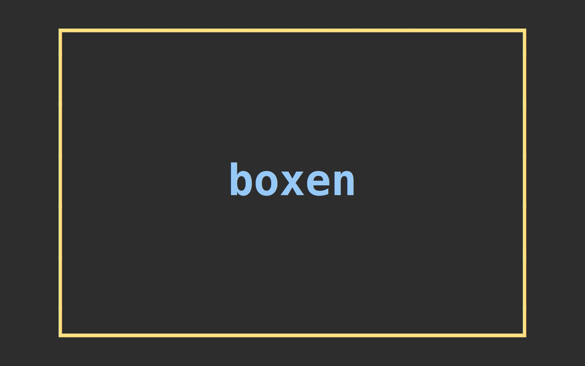

# 

> Create boxes in the terminal

[](https://travis-ci.org/sindresorhus/boxen)


## Install

```
$ npm install --save boxen
```


## Usage

```js
const boxen = require('boxen');

console.log(boxen('unicorn', {padding: 1}));
/*
┌─────────────┐
│             │
│   unicorn   │
│             │
└─────────────┘
*/

console.log(boxen('unicorn', {padding: 1, margin: 1}));
/*

   ┌─────────────┐
   │             │
   │   unicorn   │
   │             │
   └─────────────┘

*/
```


## API

### boxen(input, [options])

#### input

Type: `string`

Text inside the box.

#### options

##### borderColor

Type: `string`  
Values: `black` `red` `green` `yellow` `blue` `magenta` `cyan` `white` `gray`

Color of the box border.

##### padding

Type: `number`, `object`  
Default: `0`

Space between the text and box border.

Accepts a number or an object with any of the `top`, `right`, `bottom`, `left` properties. When a number is specified, the left/right padding is 3 times the top/bottom to make it look nice.

##### margin

Type: `number`, `object`  
Default: `0`

Space around the box.

Accepts a number or an object with any of the `top`, `right`, `bottom`, `left` properties. When a number is specified, the left/right margin is 3 times the top/bottom to make it look nice.


## License

MIT © [Sindre Sorhus](http://sindresorhus.com)
