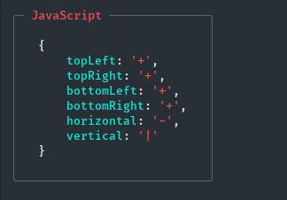

# fieldset-cli [](https://travis-ci.org/horosgrisa/fieldset-cli)

> Create boxes in the terminal


#### This is temporary fork of [boxen](https://github.com/sindresorhus/boxen) with posibility to set title of box

#### Example



## Install

```
$ npm install fieldset-cli
```


## Usage

```js
const fieldset = require('fieldset-cli');

console.log(fieldset('unicorn', {padding: 1}));
/*
┌─────────────┐
│             │
│   unicorn   │
│             │
└─────────────┘
*/

console.log(fieldset('unicorn', {padding: 1, margin: 1, borderStyle: 'double'}));
/*

   ╔═════════════╗
   ║             ║
   ║   unicorn   ║
   ║             ║
   ╚═════════════╝

*/
```


## API

### fieldset(text, options?)

#### text

Type: `string`

Text inside the box.

#### options

Type: `object`

##### title

Type: `string`<br>
Title of box

##### titleColor

Type: `string`<br>
Values: `'black'` `'red'` `'green'` `'yellow'` `'blue'` `'magenta'` `'cyan'` `'white'` `'gray'` or a hex value like `'#ff0000'`

Color of the box title.

##### titleDim

Type: `boolean`<br>
Default: `false`

Reduce opacity of the box title.

##### borderColor

Type: `string`<br>
Values: `'black'` `'red'` `'green'` `'yellow'` `'blue'` `'magenta'` `'cyan'` `'white'` `'gray'` or a hex value like `'#ff0000'`

Color of the box border.

##### borderStyle

Type: `string | object`<br>
Default: `'single'`<br>
Values:
- `'single'`
```
┌───┐
│foo│
└───┘
```
- `'double'`
```
╔═══╗
║foo║
╚═══╝
```
- `'round'` (`'single'` sides with round corners)
```
╭───╮
│foo│
╰───╯
```
- `'bold'`
```
┏━━━┓
┃foo┃
┗━━━┛
```
- `'singleDouble'` (`'single'` on top and bottom, `'double'` on right and left)
```
╓───╖
║foo║
╙───╜
```
- `'doubleSingle'` (`'double'` on top and bottom, `'single'` on right and left)
```
╒═══╕
│foo│
╘═══╛
```
- `'classic'`
```
+---+
|foo|
+---+
```

Style of the box border.

Can be any of the above predefined styles or an object with the following keys:

```js
{
	topLeft: '+',
	topRight: '+',
	bottomLeft: '+',
	bottomRight: '+',
	horizontal: '-',
	vertical: '|'
}
```

##### dimBorder

Type: `boolean`<br>
Default: `false`

Reduce opacity of the border.

##### padding

Type: `number | object`<br>
Default: `0`

Space between the text and box border.

Accepts a number or an object with any of the `top`, `right`, `bottom`, `left` properties. When a number is specified, the left/right padding is 3 times the top/bottom to make it look nice.

##### margin

Type: `number | object`<br>
Default: `0`

Space around the box.

Accepts a number or an object with any of the `top`, `right`, `bottom`, `left` properties. When a number is specified, the left/right margin is 3 times the top/bottom to make it look nice.

##### float

Type: `string`<br>
Default: `'left'`
Values: `'right'` `'center'` `'left'`<br>

Float the box on the available terminal screen space.

##### backgroundColor

Type: `string`
Values: `'black'` `'red'` `'green'` `'yellow'` `'blue'` `'magenta'` `'cyan'` `'white'` `'gray'` or a hex value like `'#ff0000'`

Color of the background.

##### align

Type: `string`<br>
Default: `'left'`<br>
Values: `'left'` `'center'` `'right'`

Align the text in the box based on the widest line.


