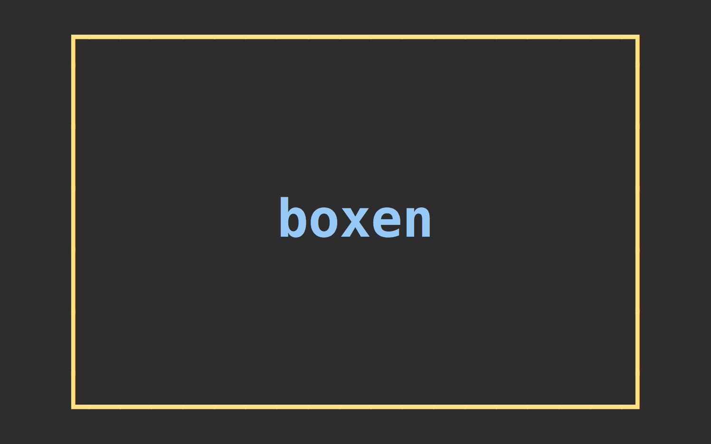

# boxen

> Create boxes in the terminal



## Install

```sh
npm install boxen
```

## Usage

```js
import boxen from 'boxen';

console.log(boxen('unicorn', {padding: 1}));
/*
┌─────────────┐
│             │
│   unicorn   │
│             │
└─────────────┘
*/

console.log(boxen('unicorn', {padding: 1, margin: 1, borderStyle: 'double'}));
/*

   ╔═════════════╗
   ║             ║
   ║   unicorn   ║
   ║             ║
   ╚═════════════╝

*/

console.log(boxen('unicorns love rainbows', {title: 'magical', titleAlignment: 'center'}));
/*
┌────── magical ───────┐
│unicorns love rainbows│
└──────────────────────┘
*/
```

## API

### boxen(text, options?)

#### text

Type: `string`

Text inside the box.

#### options

Type: `object`

##### borderColor

Type: `string`\
Values: `'black'` `'red'` `'green'` `'yellow'` `'blue'` `'magenta'` `'cyan'` `'white'` `'gray'` or a hex value like `'#ff0000'`

Color of the box border.

##### borderStyle

Type: `string | object`\
Default: `'single'`\
Values:
- `'single'`
```text
┌───┐
│foo│
└───┘
```
- `'double'`
```text
╔═══╗
║foo║
╚═══╝
```
- `'round'` (`'single'` sides with round corners)
```text
╭───╮
│foo│
╰───╯
```
- `'bold'`
```text
┏━━━┓
┃foo┃
┗━━━┛
```
- `'singleDouble'` (`'single'` on top and bottom, `'double'` on right and left)
```text
╓───╖
║foo║
╙───╜
```
- `'doubleSingle'` (`'double'` on top and bottom, `'single'` on right and left)
```text
╒═══╕
│foo│
╘═══╛
```
- `'classic'`
```text
+---+
|foo|
+---+
```
- `'arrow'`
```text
↘↓↓↓↙
→foo←
↗↑↑↑↖
```
- `'none'`
```text
foo
```

Style of the box border.

Can be any of the above predefined styles or an object with the following keys:

```js
{
	topLeft: '+',
	topRight: '+',
	bottomLeft: '+',
	bottomRight: '+',
	top: '-',
	bottom: '-',
	left: '|',
	right: '|'
}
```

##### dimBorder

Type: `boolean`\
Default: `false`

Reduce opacity of the border.

##### title

Type: `string`

Display a title at the top of the box.
If needed, the box will horizontally expand to fit the title.

Example:
```js
console.log(boxen('foo bar', {title: 'example'}));
/*
┌ example ┐
│foo bar  │
└─────────┘
*/
```

##### titleColor

Type: `string`\
Default: `borderColor` if set, otherwise the terminal's text color\
Values: `'black'` `'red'` `'green'` `'yellow'` `'blue'` `'magenta'` `'cyan'` `'white'` `'gray'` `'grey'` `'blackBright'` `'redBright'` `'greenBright'` `'yellowBright'` `'blueBright'` `'magentaBright'` `'cyanBright'` `'whiteBright'` or a hex value like `'#ff0000'`

Color of the title.

Styling already applied to the `title` takes precedence over this option.

Example:
```js
// Blue border with a red title
console.log(boxen('foo bar', {title: 'example', borderColor: 'blue', titleColor: 'red'}));
/*
┌ example ┐
│foo bar  │
└─────────┘
*/
```

##### titleAlignment

Type: `string`\
Default: `'left'`

Align the title in the top bar.

Values:
- `'left'`
```js
/*
┌ example ──────┐
│foo bar foo bar│
└───────────────┘
*/
```
- `'center'`
```js
/*
┌─── example ───┐
│foo bar foo bar│
└───────────────┘
*/
```
- `'right'`
```js
/*
┌────── example ┐
│foo bar foo bar│
└───────────────┘
*/
```

##### footer

Type: `string`

Display a footer at the bottom of the box.
If needed, the box will horizontally expand to fit the footer.

The footer uses the border color.

Example:
```js
console.log(boxen('foo bar', {footer: 'example'}));
/*
┌─────────┐
│foo bar  │
└ example ┘
*/
```

##### footerAlignment

Type: `string`\
Default: `'left'`

Align the footer in the bottom bar.

Values:
- `'left'`
```js
/*
┌───────────────┐
│foo bar foo bar│
└ example ──────┘
*/
```
- `'center'`
```js
/*
┌───────────────┐
│foo bar foo bar│
└─── example ───┘
*/
```
- `'right'`
```js
/*
┌───────────────┐
│foo bar foo bar│
└────── example ┘
*/
```

##### width

Type: `number`

Set a fixed width for the box.

*Note:* This disables terminal overflow handling and may cause the box to look broken if the user's terminal is not wide enough.

```js
import boxen from 'boxen';

console.log(boxen('foo bar', {width: 15}));
// ┌─────────────┐
// │foo bar      │
// └─────────────┘
```

##### maxWidth

Type: `number`

Set a maximum width for the box.

The box grows with the content and does not become wider than this value.

A character that is wider than the space left for it can still widen the box, because a character is never split.

*Note:* This option has no effect when `width` is set.

```js
import boxen from 'boxen';

console.log(boxen('foo bar', {maxWidth: 20}));
// ┌───────┐
// │foo bar│
// └───────┘

console.log(boxen('Lorem ipsum dolor sit amet, consectetur.', {maxWidth: 20}));
// ┌─────────────────┐
// │Lorem ipsum dolor│
// │sit amet,        │
// │consectetur.     │
// └─────────────────┘
```

##### height

Type: `number`

Set a fixed height for the box.

*Note:* This option will crop overflowing content.

```js
import boxen from 'boxen';

console.log(boxen('foo bar', {height: 5}));
// ┌───────┐
// │foo bar│
// │       │
// │       │
// └───────┘
```

##### fullscreen

Type: `boolean | (width: number, height: number) => [width: number, height: number]`

Whether or not to fit all available space within the terminal.

Pass a callback function to control box dimensions:

```js
import boxen from 'boxen';

console.log(boxen('foo bar', {
	fullscreen: (width, height) => [width, height - 1],
}));
```

##### padding

Type: `number | object`\
Default: `0`

Space between the text and box border.

Accepts a number or an object with any of the `top`, `right`, `bottom`, `left` properties. When a number is specified, the left/right padding is 3 times the top/bottom to make it look nice.

##### margin

Type: `number | object`\
Default: `0`

Space around the box.

Accepts a number or an object with any of the `top`, `right`, `bottom`, `left` properties. When a number is specified, the left/right margin is 3 times the top/bottom to make it look nice.

##### float

Type: `string`\
Default: `'left'`\
Values: `'right'` `'center'` `'left'`

Float the box on the available terminal screen space.

##### backgroundColor

Type: `string`\
Values: `'black'` `'red'` `'green'` `'yellow'` `'blue'` `'magenta'` `'cyan'` `'white'` `'gray'` or a hex value like `'#ff0000'`

Color of the background.

##### borderBackgroundColor

Type: `string`\
Values: `'black'` `'red'` `'green'` `'yellow'` `'blue'` `'magenta'` `'cyan'` `'white'` `'gray'` `'inherit'` `undefined` or a hex value like `'#ff0000'`

Color of the background of the border.

`'inherit'` will use the same value as `options.backgroundColor` if set.

Defaults to `'inherit'`. Set this to `undefined` to disable border background color.

##### textAlignment

Type: `string`\
Default: `'left'`\
Values: `'left'` `'center'` `'right'`

Align the text in the box based on the widest line.

## Maintainer

- [Sindre Sorhus](https://github.com/sindresorhus)
- [Caesarovich](https://github.com/Caesarovich)

## Related

- [boxen-cli](https://github.com/sindresorhus/boxen-cli) - CLI for this module
- [cli-boxes](https://github.com/sindresorhus/cli-boxes) - Boxes for use in the terminal
